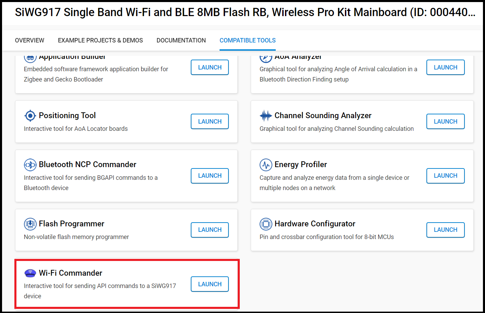
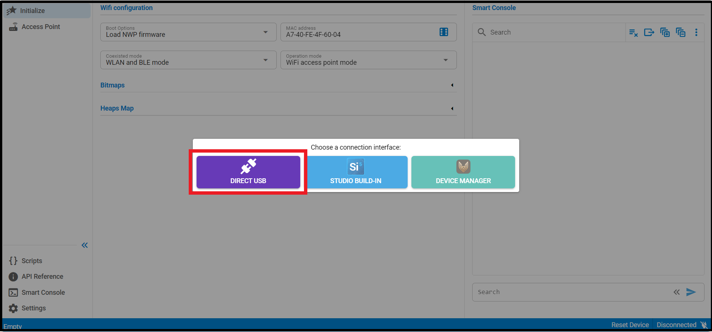
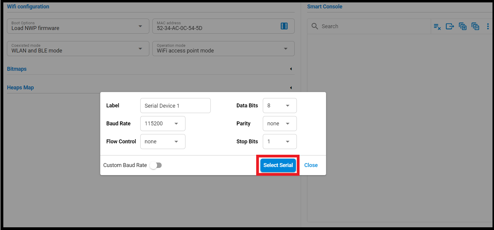
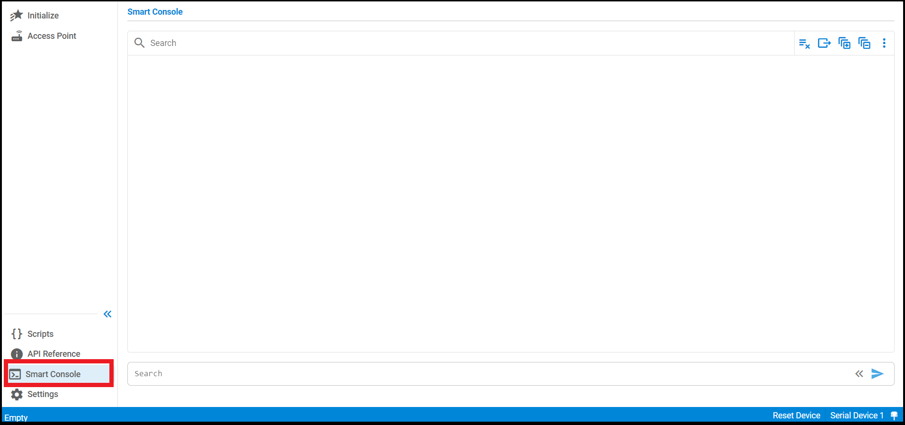
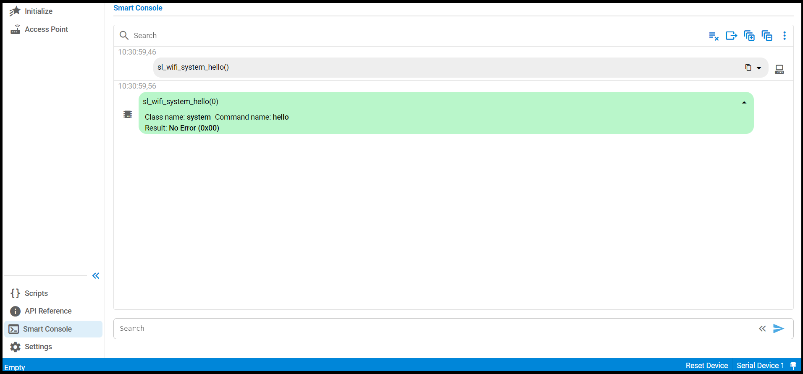

# Wi-Fi Commander

## Table of Contents

- [Wi-Fi Commander](#wi-fi-commander)
  - [Table of Contents](#table-of-contents)
  - [Purpose/Scope](#purposescope)
  - [Prerequisites/Setup Requirements](#prerequisitessetup-requirements)
    - [Hardware Requirements](#hardware-requirements)
    - [Software Requirements](#software-requirements)
    - [Setup Diagram](#setup-diagram)
  - [Getting Started](#getting-started)
  - [Application Build Environment](#application-build-environment)
  - [Test the Application](#test-the-application)
  - [Exploring Supported Features and Commands](#exploring-supported-features-and-commands)
    - [Entering Commands in Wi-Fi Commander](#entering-commands-in-wi-fi-commander)

## Purpose/Scope

The Wi-Fi Commander application is a command-line interface application designed to showcase various functionalities and capabilities of SiWx91x in different scenarios and configuration modes. It serves as a quick reference guide and a hands-on demonstration of SiWx91x core features for developers and users.

## Prerequisites/Setup Requirements

Before running the application, the user will need to set up the following things:

### Hardware Requirements

- A Windows PC.

- **SoC Mode**:
  - Standalone
    - BRD4002A Wireless pro kit mainboard [SI-MB4002A]
    - Radio Boards 
      - BRD4338A [SiWx917-RB4338A]
  - Kits
    - SiWx917 Pro Kit [Si917-PK6031A](https://www.silabs.com/development-tools/wireless/wi-fi/siwx917-pro-kit?tab=overview)

### Software Requirements

- Simplicity Studio
- Wi-Fi Commander Tool
- Mobile Phone

>**Notes:**
>
>- The Wi-Fi Commander tool is used to send commands and receive corresponding responses and events from the SiWx91x device.
>- The mobile phone shown in the setup diagram is optional and can be used to verify network functionality, such as connecting to the Access Point and accessing services hosted on the SiWx91x device.

### Setup Diagram

## Getting Started

The application operates on a PC, referred to as the Wi-Fi Commander tool, while the Wi-Fi stack runs on SiWx91x chipset in SoC Mode, known as the target.

The communication between the Wi-Fi Commander tool and target occurs via a serial interface (UART), which can be tunneled through USB if you are using a development kit. This communication is defined by Silicon Labs' proprietary protocol called xAPI.

Refer to the instructions here:

- Install Studio and the WiSeConnect extension.
- Connect your device to the computer.
- Upgrade your connectivity firmware.
- Create a Studio project.
- Open the Wi-Fi Commander tool.

## Application Build Environment

- The application uses the default Access Point (AP) configurations provided as below:

  - Default SSID of the WiSeConnect soft AP that will be "MY_AP_SSID".

  - Default secret key of the WiSeConnect soft AP that will be "MY_AP_PASSPHRASE".

> **Note:**
> If you want to modify the above settings, you can also do so by updating the configuration using the Wi-Fi Commander tool.

> **Recommended Settings:** For optimal configuration, see the [Recommendations Guide](https://docs.silabs.com/wiseconnect/latest/wiseconnect-developers-guide-prog-recommended-settings/).

## Test the Application

Refer to the instructions [here](https://docs.silabs.com/wiseconnect/latest/wiseconnect-getting-started/) to:

1. Build the application.
2. Flash, run and debug the application.
3. After the application has been successfully flashed, Wi-Fi commander tool would recieve `sl_wifi_evt_system_boot` event indicating module is ready and tool can now send commands and receive the corresponding responses and events.

### Evaluating with Wi-Fi Commander

 To evaluate your board using Wi-Fi Commander, follow these steps:

1. Launch Simplicity Studio on your PC.
   - Navigate to the Launcher.
   - Click on **Compatible Tools**.
   - Locate and launch **Wi-Fi Commander**.
   - Ensure your board is connected via USB before proceeding.

   

2. Select the interface that you will use to establish a connection.

   

3. Select the serial port from the list and click **Connect**.

   

4. Click on the **Access Point** tab to set the default configuration, test the functionality, and view the corresponding responses and events.

   

   

5. The expected outcome for the access point functionality by using the default configuration.

   

6. Click the **Smart Console** tab, where you can enter commands and receive the corresponding responses and events.

   

## Exploring Supported Features and Commands

The Wi-Fi Commander tool includes a built-in command set and documentation interface that allows users to explore all supported features and commands available for the SiWx91x device.

To access this information:

1. Open the Wi-Fi Commander tool from Simplicity Studio.
2. Navigate to the **API Reference** tab.

This tab displays a categorized list of supported commands, along with detailed descriptions, parameters, and expected responses.

### Entering Commands in Wi-Fi Commander

The following example shows how to enter the commands in the Wi-Fi Commander and get the responses.

- **hello Command:-** 

 ****
