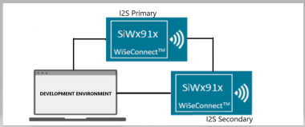
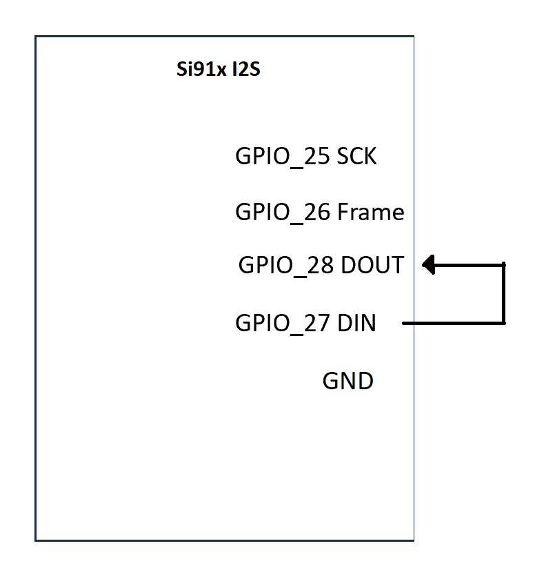
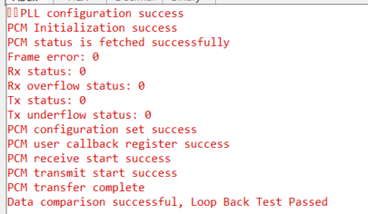

# SL PCM LOOPBACK

## Table of Contents

- [SL PCM LOOPBACK](#sl-pcm-loopback)
  - [Table of Contents](#table-of-contents)
  - [Purpose/Scope](#purposescope)
  - [Overview](#overview)
  - [About Example Code](#about-example-code)
  - [Prerequisites/Setup Requirements](#prerequisitessetup-requirements)
    - [Hardware Requirements](#hardware-requirements)
    - [Software Requirements](#software-requirements)
    - [Setup Diagram](#setup-diagram)
  - [Getting Started](#getting-started)
  - [Application Build Environment](#application-build-environment)
    - [General Configuration](#general-configuration)
    - [Using ULP\_PCM Instance](#using-ulp_pcm-instance)
    - [Pin Configuration](#pin-configuration)
    - [Pin Description](#pin-description)
  - [Test the Application](#test-the-application)

## Purpose/Scope

- This application demonstrates the PCM loopback functionality.

## Overview

- Supports programmable audio data resolutions of 16, 24, and 32 bits.
- Supported audio sampling rates are 8, 11.025, 16, 22.05, and 24 kHz.
- Supports Master and Slave modes.
- Full duplex communication with independent transmitter and receiver.
- Programmable FIFO thresholds with a maximum FIFO depth of 8 and support for DMA.
- Generates interrupts for various events.

## About Example Code

- This example initializes the PCM peripheral and configures it for loopback mode.
- Initializes the PCM peripheral and stores the driver handle in `pcm_handle` using `sl_si91x_pcm_init()`.
- Configures the PCM transfer parameters using `sl_si91x_pcm_set_configuration()`.
- Configures DMA channels for both transmit and receive operations.
- Transmits data and waits for the data to be received in loopback mode.
- Compares the transmitted and received data to verify loopback functionality.
- Application remains in a wait state until the data transfer is complete.
- Test passes after successful data comparison.

>**Note!**
>Ensure transfer sizes align with the resolution requirements (for example, multiples of 4 for 24-bit resolutions).

## Prerequisites/Setup Requirements

### Hardware Requirements

- Windows PC
- Silicon Labs Si917 Evaluation Kit [[BRD4002](https://www.silabs.com/development-tools/wireless/wireless-pro-kit-mainboard?tab=overview) + [BRD4338A](https://www.silabs.com/development-tools/wireless/wi-fi/siwx917-rb4338a-wifi-6-bluetooth-le-soc-radio-board?tab=overview) / [BRD4342A](https://www.silabs.com/development-tools/wireless/wi-fi/siwx91x-rb4342a-wifi-6-bluetooth-le-soc-radio-board?tab=overview) / [BRD4343A](https://www.silabs.com/development-tools/wireless/wi-fi/siw917y-rb4343a-wi-fi-6-bluetooth-le-8mb-flash-radio-board-for-module?tab=overview)]
- SiWx917 AC1 Module Explorer Kit [BRD2708A](https://www.silabs.com/development-tools/wireless/wi-fi/siw917y-ek2708a-explorer-kit)

### Software Requirements

- Simplicity Studio
- Serial console setup
  - For Serial Console setup instructions, refer to [link name](https://docs.silabs.com/wiseconnect/latest/wiseconnect-developers-guide-developing-for-silabs-hosts/using-the-simplicity-studio-ide#console-input-and-output).

### Setup Diagram

>

## Getting Started

Refer to the instructions [here](https://docs.silabs.com/wiseconnect/latest/wiseconnect-getting-started/) to:

- [Install Simplicity Studio](https://docs.silabs.com/wiseconnect/latest/wiseconnect-developers-guide-developing-for-silabs-hosts/using-the-simplicity-studio-ide#install-simplicity-studio)
- [Install WiSeConnect extension](https://docs.silabs.com/wiseconnect/latest/wiseconnect-developers-guide-developing-for-silabs-hosts/using-the-simplicity-studio-ide#install-the-wiseconnect-3-extension)
- [Connect your device to the computer](https://docs.silabs.com/wiseconnect/latest/wiseconnect-developers-guide-developing-for-silabs-hosts/using-the-simplicity-studio-ide#connect-siwx91x-to-computer)
- [Upgrade your connectivity firmware](https://docs.silabs.com/wiseconnect/latest/wiseconnect-developers-guide-developing-for-silabs-hosts/using-the-simplicity-studio-ide#update-siwx91x-connectivity-firmware)
- [Create a Studio project](https://docs.silabs.com/wiseconnect/latest/wiseconnect-developers-guide-developing-for-silabs-hosts/using-the-simplicity-studio-ide#create-a-project).

For details on the project folder structure, see the [WiSeConnect Examples](https://docs.silabs.com/wiseconnect/latest/wiseconnect-examples/#example-folder-structure) page.

## Application Build Environment

1. Configure UC from the slcp component.
2. Open **sl_si91x_pcm_loopback.slcp** project file, select the **software component** tab, and search for **PCM** in the search bar.

### General Configuration

Using the configuration wizard, configure parameters as follows:

- `SL_PCM0_RESOLUTION`: PCM resolution can be configured through this macro. Valid resolution values are 16, 24, and 32 bits.
- `SL_PCM0_SAMPLING_RATE`: PCM sampling rate can be configured through this macro. Valid sampling rate values are 8 kHz, 11.025, 16, 22.05, and 24 kHz.

Configuration files are generated in the **config** folder. If not changed, the code will run on default UC values.

Configure the following macros in [`pcm_loopback.c`](https://github.com/SiliconLabs/wiseconnect/blob/v4.0.0-content-for-docs/examples/si91x_soc/peripheral/sl_si91x_pcm_loopback/pcm_loopback.c) file and update/modify them if required.

  ```C
  #define PCM_LOOPBACK_BUFFER_SIZE 1024    ///< Transmit/Receive buffer size
  ```

- If the resolution is changed to 24-bit or 32-bit, update the typedef for `pcm_data_size_t` to `uint32_t` instead of `uint16_t` to accommodate the larger data size - 

 ```C
 typedef uint32_t pcm_data_size_t;
 ```

### Using ULP_PCM Instance

To use the ULP_PCM instance instead of the default PCM0 instance:

- Change the `PCM_INSTANCE` macro value to `ULP_PCM` in pcm_loopback_exmaple.c:

  ```C
  #define PCM_INSTANCE ULP_PCM
  ```

### Pin Configuration

|   GPIO    | Breakout pin on WPK (4002A baseboard) | Breakout pin Explorer kit |  Description     |
| ----------| --------------------------------------|-------------------------- | ---------------- |
| GPIO_25   |         P25                           |          [SCK]            | PCM SCK          |
| GPIO_26   |         P27                           |          [MISO]           | PCM Frame Sync   |
| GPIO_28   |         P31                           |          [CS]             | PCM DOUT         |
| GPIO_27   |         P29                           |          [MOSI]           | PCM DIN          |

- For pin connections, refer to the following diagram:

  

- Pin Description

 >**Note:** The default pin configurations are set in the SiWx917:[RTE_Device_917.h](path:/$project/config/RTE_Device_917.h) file. Verify that these pin settings match your hardware setup. You can modify the pin configurations in this file if your board uses different GPIO pins for the PCM interface.

## Test the Application

Refer to the instructions [here](https://docs.silabs.com/wiseconnect/latest/wiseconnect-getting-started/) to:

1. Compile and run the PCM loopback application on the board.
2. The application transmits data and receives it in loopback mode.
3. After successful program execution, the prints in the serial console look as shown below.

   

> **Note:**
>
> - Interrupt handlers are implemented in the driver layer, and user callbacks are provided for custom code. If you want to write your own interrupt handler instead of using the default one, make the driver interrupt handler a weak handler. Then, copy the necessary code from the driver handler to your custom interrupt handler.
> - pcm0 or ulp_pcm uses i2s0 and ulp_i2s peripherals internally. It is recommended not to install the i2s0 and ulp_i2s instances simultaneously with pcm0 or ulp_pcm, as this may cause resource conflicts.