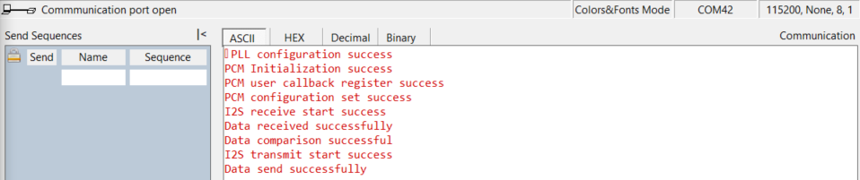

# SL Pulse Code Modulation (PCM) Primary

## Table of Contents

- [SL PCM PRIMARY](#sl-pcm-primary)
  - [Table of Contents](#table-of-contents)
  - [Purpose/Scope](#purposescope)
  - [Overview](#overview)
  - [About Example Code](#about-example-code)
  - [Prerequisites/Setup Requirements](#prerequisitessetup-requirements)
    - [Hardware Requirements](#hardware-requirements)
    - [Software Requirements](#software-requirements)
    - [Setup Diagram](#setup-diagram)
  - [Getting Started](#getting-started)
  - [Application Build Environment](#application-build-environment)
    - [General Configuration](#general-configuration)
    - [Using ULP\_PCM Instance](#using-ulp_pcm-instance)
    - [Pin Configuration](#pin-configuration)
    - [Pin Description](#pin-description)
  - [Test the Application](#test-the-application)

## Purpose/Scope

This application demonstrates the Pulse Code Modulation (PCM) primary device data transfer using the I2S interface.

## Overview

- PCM is implemented using the I2S interface.
- The PCM Mode supports only mono mode.
- Programmable mono audio data resolutions of 16, 24, and 32 bits.
- Supported audio sampling rates are 8, 11.025, 16, 22.05, and 24 KHz.
- Support for Master and Slave modes.
- Full duplex communication due to the independence of transmitter and receiver.
- Programmable FIFO thresholds with maximum FIFO depth of 8 and support for DMA.
- Supports generation of interrupts for different events.

## About Example Code

- Initialize the PCM peripheral (via I2S) and stores the driver handle in pcm_handle using [sl_si91x_pcm_init()](https://docs.silabs.com/wiseconnect/latest/wiseconnect-api-reference-guide-si91x-peripherals/pcm#sl-si91x-pcm-init).
- Register user callback using [sl_si91x_pcm_register_event_callback()](https://docs.silabs.com/wiseconnect/latest/wiseconnect-api-reference-guide-si91x-peripherals/pcm#sl-si91x-pcm-register-event-callback).
- Configure transmitter transfer parameters for PCM using [sl_si91x_pcm_set_configuration()](https://docs.silabs.com/wiseconnect/latest/wiseconnect-api-reference-guide-si91x-peripherals/pcm#sl-si91x-pcm-set-configuration).
- Configure receive DMA channel and wait for data to be received from the secondary device.
- When data is received by the receiver channel, it compares the data received with the transferred data.
- Configure transmit DMA channel and send data.
- The application will be in a wait state until data transmission is complete.
- The test will pass after successful data comparison.

**Note!** 

1. Any PCM transfers with 16-bit and 32-bit resolutions should only have an even transfer size (8,10,12,14...)
2. Any PCM transfers with 24-bit resolutions should only have transfer size as multiples of 4 (8,12,16,20...)
3. Frame-sync will be equal to the sampling frequency, but if measured with a logic analyzer or a device that does not support mono PCM, it will appear as double the sampling frequency.
4. PCM is not supported with low power states.

## Prerequisites/Setup Requirements

### Hardware Requirements

- Windows PC
- Silicon Labs Si917 Evaluation Kit [[BRD4002](https://www.silabs.com/development-tools/wireless/wireless-pro-kit-mainboard?tab=overview) + [BRD4338A](https://www.silabs.com/development-tools/wireless/wi-fi/siwx917-rb4338a-wifi-6-bluetooth-le-soc-radio-board?tab=overview) / [BRD4342A](https://www.silabs.com/development-tools/wireless/wi-fi/siwx91x-rb4342a-wifi-6-bluetooth-le-soc-radio-board?tab=overview) / [BRD4343A](https://www.silabs.com/development-tools/wireless/wi-fi/siw917y-rb4343a-wi-fi-6-bluetooth-le-8mb-flash-radio-board-for-module?tab=overview)]
- SiWx917 AC1 Module Explorer Kit [BRD2708A](https://www.silabs.com/development-tools/wireless/wi-fi/siw917y-ek2708a-explorer-kit)

### Software Requirements

- Simplicity Studio
- Serial console Setup
  - For Serial Console setup instructions, refer to [link name](https://docs.silabs.com/wiseconnect/latest/wiseconnect-developers-guide-developing-for-silabs-hosts/using-the-simplicity-studio-ide#console-input-and-output).

### Setup Diagram

 >

## Getting Started

Refer to the instructions [here](https://docs.silabs.com/wiseconnect/latest/wiseconnect-getting-started/) to:

- [Install Simplicity Studio](https://docs.silabs.com/wiseconnect/latest/wiseconnect-developers-guide-developing-for-silabs-hosts/using-the-simplicity-studio-ide#install-simplicity-studio)
- [Install WiSeConnect extension](https://docs.silabs.com/wiseconnect/latest/wiseconnect-developers-guide-developing-for-silabs-hosts/using-the-simplicity-studio-ide#install-the-wiseconnect-3-extension)
- [Connect your device to the computer](https://docs.silabs.com/wiseconnect/latest/wiseconnect-developers-guide-developing-for-silabs-hosts/using-the-simplicity-studio-ide#connect-siwx91x-to-computer)
- [Upgrade your connectivity firmware](https://docs.silabs.com/wiseconnect/latest/wiseconnect-developers-guide-developing-for-silabs-hosts/using-the-simplicity-studio-ide#update-siwx91x-connectivity-firmware)
- [Create a Studio project](https://docs.silabs.com/wiseconnect/latest/wiseconnect-developers-guide-developing-for-silabs-hosts/using-the-simplicity-studio-ide#create-a-project)

For details on the project folder structure, see the [WiSeConnect Examples](https://docs.silabs.com/wiseconnect/latest/wiseconnect-examples/#example-folder-structure) page.

## Application Build Environment

1. Configure UC from the slcp component.
2. Open **sl_si91x_pcm_primary.slcp** project file, select **Software component** tab and search for **PCM** in search bar.

  

### General Configuration 

- SL_PCM0_RESOLUTION: PCM0 resolution can be configured through this macro,valid resolution values are 16, 24 and 32 bit.
- SL_PCM0_SAMPLING_RATE: PCM0 sampling rate can be configured through this macro,valid sampling rate values are
    8kHz, 11.025kHz, 16kHz, 22.05kHz and 24kHz.
- Configuration files are generated in **config folder**, if not changed then the code will run on default UC values.

Configure the following macros in [`pcm_primary_example.c`](https://github.com/SiliconLabs/wiseconnect/blob/v4.0.0-content-for-docs/examples/si91x_soc/peripheral/sl_si91x_pcm_primary/pcm_primary_example.c) file and update/modify the following macros if required.

```C
 #define PCM_PRIMARY_BUFFER_SIZE 1024    ///< Transmit/Receive buffer size
```

- If the resolution is changed to 24-bit or 32-bit, update the typedef for `pcm_data_size_t` to `uint32_t` instead of `uint16_t` to accommodate the larger data size - 

 ```C
 typedef uint32_t pcm_data_size_t;
 ```

### Using ULP_PCM Instance

To use the ULP_PCM instance instead of the default PCM0 instance:

- Change the `PCM_INSTANCE` macro value to `ULP_PCM` in [`pcm_primary_example.c`](https://github.com/SiliconLabs/wiseconnect/blob/v4.0.0-content-for-docs/examples/si91x_soc/peripheral/sl_si91x_pcm_primary/pcm_primary_example.c):

  ```C
  #define PCM_INSTANCE ULP_PCM
  ```

### Pin Configuration

|   GPIO    | Breakout pin on WPK (4002A baseboard) | Breakout pin Explorer kit |  Description     |
| ----------| --------------------------------------|-------------------------- | ---------------- |
| GPIO_25   |         P25                           |          [SCK]            | I2S SCK          |
| GPIO_26   |         P27                           |          [MISO]           | I2S Frame-sync   |
| GPIO_28   |         P31                           |          [CS]             | I2S DOUT         |
| GPIO_27   |         P29                           |          [MOSI]           | I2S DIN          |

- For pin connections, refer to the following diagrams

  

  ### Pin Description

   >**Note:** The default pin configurations are set in the SiWx917:[RTE_Device_917.h](path:/$project/config/RTE_Device_917.h) file. Verify that these pin settings match your hardware setup. You can modify the pin configurations in this file if your board uses different GPIO pins for the PCM interface.

## Test the Application

Refer to the instructions [here](https://docs.silabs.com/wiseconnect/latest/wiseconnect-getting-started/) to:

1. Take two Silicon Labs boards: Si917 Evaluation Kit WPK (BRD4002) and one of BRD4325A / BRD4325B / BRD4338A.
2. On the first board, compile and run the PCM secondary device application.
3. On the other board, compile and run the PCM primary application.
4. When the primary application starts, it shows the message:
   "Reset Secondary and Press Button 0 on Primary to sync."
5. Reset the secondary board. After reset, the secondary console prints:
   "Waiting for primary button 0 press to sync with primary."
6. Press Button 0 on the primary board to complete the synchronization.
7. After sync, the primary receives data from the secondary device, compares it, and then sends data back to the secondary device.
8. When the primary sends data back, the secondary device receives it and performs loopback comparison to validate the data.
9. After successful execution, the serial console will show the expected output logs.

    >

> **Note:**
>
> - Interrupt handlers are implemented in the driver layer, and user callbacks are provided for custom code. If you want to write your own interrupt handler instead of using the default one, make the driver interrupt handler a weak handler. Then, copy the necessary code from the driver handler to your custom interrupt handler.
> - pcm0 or ulp_pcm uses i2s0 and ulp_i2s peripherals internally. It is recommended not to install the i2s0 and ulp_i2s instances simultaneously with pcm0 or ulp_pcm, as this may cause resource conflicts.