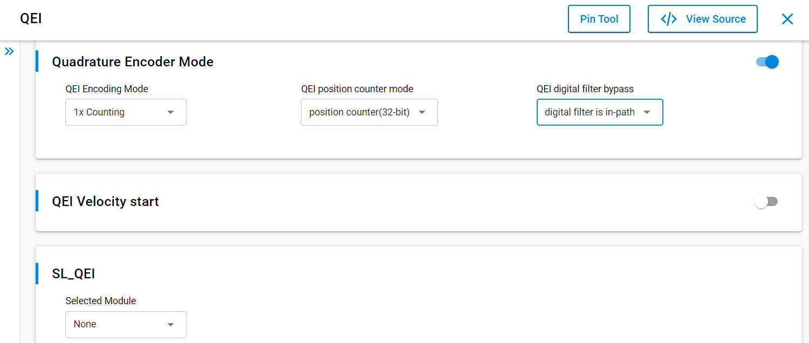
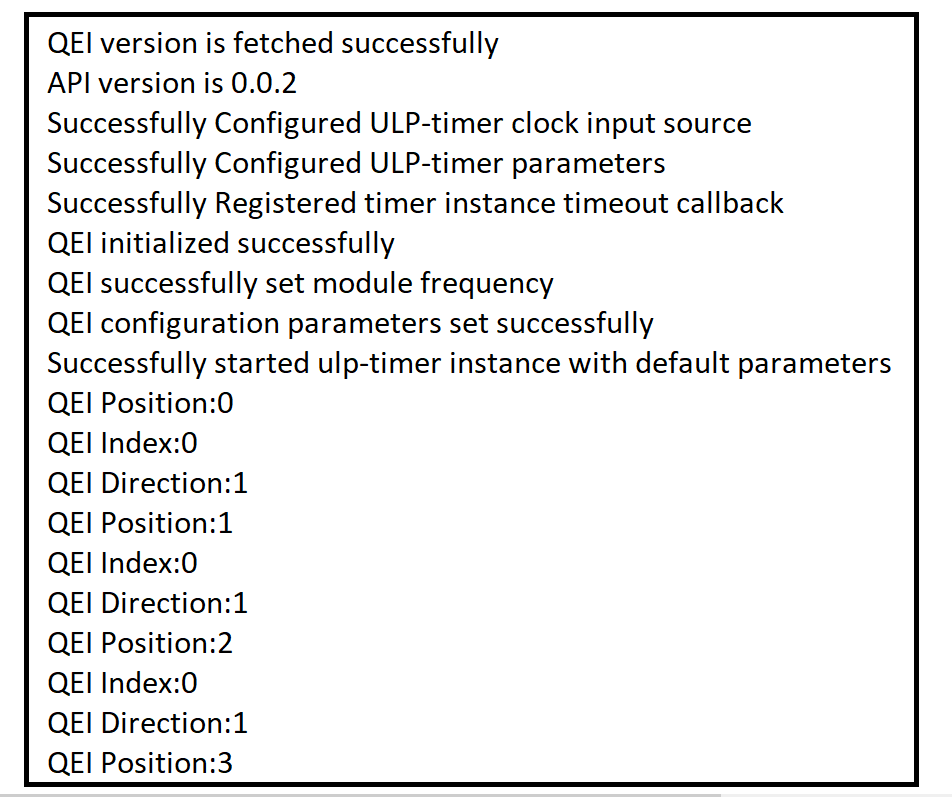

# SL QEI

## Table of Contents

- [SL QEI](#sl-qei)
  - [Table of Contents](#table-of-contents)
  - [Purpose/Scope](#purposescope)
  - [Overview](#overview)
  - [About Example Code](#about-example-code)
  - [Prerequisites/Setup Requirements](#prerequisitessetup-requirements)
    - [Hardware Requirements](#hardware-requirements)
    - [Software Requirements](#software-requirements)
    - [Setup Diagram](#setup-diagram)
  - [Getting Started](#getting-started)
  - [Application Build Environment](#application-build-environment)
    - [Application Configuration Parameters](#application-configuration-parameters)
    - [Pin Configuration](#pin-configuration)
  - [Test the Application](#test-the-application)

## Purpose/Scope

- This application demonstrates the velocity, position count, index count, and direction measurement using the QEI module.

## Overview

- The QEI module provides the ability to measure the position and speed of a rotating encoder, which is essential for applications requiring precise motion control.
- It utilizes two input signals, Phase A and Phase B, to determine the direction of rotation, and an Index signal to mark specific positions.
- This example showcases how to configure the QEI module for real-time data acquisition, allowing for effective monitoring and control of motion systems.
- The QEI can process both incremental and absolute encoders, making it versatile for various applications in robotics, industrial automation, and consumer electronics.
- By leveraging the QEI’s high-resolution counting capabilities, users can achieve accurate position tracking and velocity measurement, enabling enhanced performance in dynamic environments.

## About Example Code

- This example demonstrates the use of the Quadrature Encoder Interface (QEI) to measure velocity, position, direction, and index counts from a quadrature encoder.
- Various parameters like phase A and phase B signals, index signal, and configuration settings can be managed using [`sl_qei_config_t`](https://docs.silabs.com/wiseconnect/latest/wiseconnect-api-reference-guide-si91x-peripherals/sl-qei-config-t).
- The example code emulates the behavior of a quadrature encoder by toggling GPIO pins for phase and index signals, simulating real-world encoder outputs.
- Dummy pulses are generated on gpio's and fed to the QEI pins using ulp timer.
- The firmware version of the QEI API is fetched using [`sl_si91x_qei_get_version`](https://docs.silabs.com/wiseconnect/latest/wiseconnect-api-reference-guide-si91x-peripherals/qei#sl-si91x-qei-get-version), which includes the release version, major version, and minor version, represented by  [`sl_qei_version_t`](https://docs.silabs.com/wiseconnect/latest/wiseconnect-api-reference-guide-si91x-peripherals/sl-qei-version-t).
- A static function initializes GPIO pins using [`sl_si91x_qei_stimulus_pin_mux_init`](https://docs.silabs.com/wiseconnect/latest/wiseconnect-api-reference-guide-si91x-peripherals/qei#sl-si91x-qei-stimulus-pin-mux-init), configuring the necessary pins for QEI operation.
- [`sl_si91x_qei_init`](https://docs.silabs.com/wiseconnect/latest/wiseconnect-api-reference-guide-si91x-peripherals/qei#sl-si91x-qei-init) is called to initialize the QEI peripheral.
- After initialization, [`sl_si91x_qei_set_configuration'] is called to set up the QEI parameters using a configuration structure [`sl_qei_config_t`].
- A callback function is registered using [`sl_si91x_qei_register_callback`](https://docs.silabs.com/wiseconnect/latest/wiseconnect-api-reference-guide-si91x-peripherals/qei#sl-si91x-qei-register-callback), allowing the application to respond to QEI interrupt events.
- The current position(range: 0 - 65535), index count(range: 0 - 65535), and direction are retrieved during processing through [`sl_si91x_qei_get_position_counter`](https://docs.silabs.com/wiseconnect/latest/wiseconnect-api-reference-guide-si91x-peripherals/qei#sl-si91x-qei-get-position-counter), [`sl_si91x_qei_get_index_counter`](https://docs.silabs.com/wiseconnect/latest/wiseconnect-api-reference-guide-si91x-peripherals/qei#sl-si91x-qei-get-index-counter), and  [`sl_si91x_qei_get_direction`](https://docs.silabs.com/wiseconnect/latest/wiseconnect-api-reference-guide-si91x-peripherals/qei#sl-si91x-qei-get-direction).
- If ENCODER_MODE macro is enabled, the application prints the current position, index, and direction of the encoder.
- If VELOCITY macro is enabled,the velocity is fetched using [`sl_si91x_qei_get_velocity`](https://docs.silabs.com/wiseconnect/latest/wiseconnect-api-reference-guide-si91x-peripherals/qei#sl-si91x-qei-get-velocity) and printed to the console when the velocity computation is completed.
- The application continuously runs in a loop, simulating the encoder’s output and processing the data to provide real-time feedback on the encoder's state.

## Prerequisites/Setup Requirements

### Hardware Requirements

- Windows PC
- Silicon Labs Si917 Evaluation Kit [WPK(BRD4002) + BRD4338A]

### Software Requirements

- Si91x
- Simplicity Studio
- Serial console Setup
  - The Serial Console setup instructions are provided below:
Refer [here](https://docs.silabs.com/wiseconnect/latest/wiseconnect-developers-guide-developing-for-silabs-hosts/using-the-simplicity-studio-ide#console-input-and-output)

### Setup Diagram


## Getting Started

Refer to the instructions [here](https://docs.silabs.com/wiseconnect/latest/wiseconnect-getting-started/) to:

- [Install Simplicity Studio](https://docs.silabs.com/wiseconnect/latest/wiseconnect-developers-guide-developing-for-silabs-hosts/using-the-simplicity-studio-ide#install-simplicity-studio)
- [Install WiSeConnect extension](https://docs.silabs.com/wiseconnect/latest/wiseconnect-developers-guide-developing-for-silabs-hosts/using-the-simplicity-studio-ide#install-the-wiseconnect-3-extension)
- [Connect your device to the computer](https://docs.silabs.com/wiseconnect/latest/wiseconnect-developers-guide-developing-for-silabs-hosts/using-the-simplicity-studio-ide#connect-siwx91x-to-computer)
- [Upgrade your connectivity firmware](https://docs.silabs.com/wiseconnect/latest/wiseconnect-developers-guide-developing-for-silabs-hosts/using-the-simplicity-studio-ide#update-siwx91x-connectivity-firmware)
- [Create a Studio project](https://docs.silabs.com/wiseconnect/latest/wiseconnect-developers-guide-developing-for-silabs-hosts/using-the-simplicity-studio-ide#create-a-project)

For details on the project folder structure, see the [WiSeConnect Examples](https://docs.silabs.com/wiseconnect/latest/wiseconnect-examples/#example-folder-structure) page.

## Application Build Environment

### Application Configuration Parameters

- Configure UC from the slcp component.
- Open **sl_si91x_qei.slcp** project file, select **Software Component** tab and search for **QEI** in search bar.
- Using configuration wizard one can configure different parameters like:

  

- **QEI Configuration**
  - Quadrature Encoder Mode: This setting controls the operation of the Quadrature Encoder.  This setting enables or disables the Quadrature Encoder mode. When enabled, the system utilizes the QEI for position tracking based on the encoder's output.
    - 0: Enable - Activates the Quadrature Encoder Mode.
    - 1: Disable - Deactivates the Quadrature Encoder Mode and user can configure for Timer Mode instead.
  - QEI Encoding Mode: Configures the position counting method of the QEI.
    - 1x Counting : SL_QEI_ENCODE_MODE_1X
    - 2x Counting : SL_QEI_ENCODE_MODE_2X 
    - 4x Counting : SL_QEI_ENCODE_MODE_4X
  - QEI Position Counter Mode: Sets the size of the position counter.
    - 32-bit position counter : SL_QEI_POS_CNT_32.
    - 16-bit position counter : SL_QEI_POS_CNT_16.
  - QEI Digital Filter Bypass: Configures the digital filter for QEI signals.
    - The digital filter is active : SL_QEI_DIGITAL_FILTER.
    - The digital filter is bypassed : SL_QEI_BYPASS_FILTER.
  - QEI Velocity Start: Enables or disables velocity calculation.
    - 0: Disable - Disables velocity calculation.
    - 1: Enable - Activates velocity calculation.
  - Delta Time: Defines the time interval used for velocity calculations.

- Configure the following macros in [`qei_example.h`](https://github.com/SiliconLabs/wiseconnect/blob/v4.0.0-content-for-docs/examples/si91x_soc/peripheral/sl_si91x_qei/qei_example.h) file and update/modify following macros if required.

  ```C
    # define BLINK_RATE       1000     // 1000 ticks per second
    # define QEI_OPERATING_FREQ    30000000  // 30MHz is QEI module frequency
    # define QEI_IDX_REVOLUTIONS  10    // Number of index revolutions for simulation
    #define SL_TIMER_MATCH_VALUE 400000 // Timer match value for down-counter type
    # define ULP_TIMER_INSTANCE   0 // ULP Timer Instance

  ```

### Pin Configuration

#### QEI Input Pin Configuration of the WPK[BRD4002A] Base Board, and BRD4338A radio board

| Description   | QEI GPIO Pin | 917 Breakout pin | 
| ------------- | ------------ | ---------------- | 
| Phase A Input |GPIO_26       | P27              | 
| Phase B Input |GPIO_27       | P29              |
| Index Input   |GPIO_25       | P25              |

#### QEI Input Pin Configuration of Explorer Kit

| Description   | Explorer Kit Pin |
| ------------- | ---------------- |
| Phase A Input |GPIO_26           |
| Phase B Input |GPIO_27           | 
| Index Input   |GPIO_25           | 

#### QEI Output Pin Configuration(for simulating QEI signals) of the WPK[BRD4002A] Base Board, and BRD4338A radio board

| Description           | QEI GPIO Pin | 917 Breakout pin | 
| --------------------- | ------------ | ---------------- | 
| Phase A Signal Output |GPIO_29       | P33              | 
| Phase B Signal Output |GPIO_30       | P35              |
| Index Signal Output   |GPIO_6        | P19              |

#### QEI Output Pin Configuration(for simulating QEI signals) of Explorer Kit

| Description           | Explorer Kit Pin |
| --------------------- | ---------------- |
| Phase A Signal Output |GPIO_29           |
| Phase B Signal Output |GPIO_30           | 
| Index Signal Output   |GPIO_6            | 

> **Note:**
>
> For Explorer Kit pinout specifications and detailed pin mapping information, refer to the official Silicon Labs User Guide available at the following location: [User Guide](https://www.silabs.com/documents/public/user-guides/ug581-brd2605a-user-guide.pdf)

## Test the Application

Refer to the instructions [here](https://docs.silabs.com/wiseconnect/latest/wiseconnect-getting-started/) to:

1. Compile and run the application.
2. Connect GPIO_29 to GPIO_26. This is phase A signal
3. Connect GPIO_30 to GPIO_27. This is phase B signal
4. Connect GPIO_6 to GPIO_25. This is index signal
5. After successful program execution the prints in serial console looks as shown below.

   > 

> **Note:**
>
> - Interrupt handlers are implemented in the driver layer, and user callbacks are provided for custom code. If you want to write your own interrupt handler instead of using the default one, make the driver interrupt handler a weak handler. Then, copy the necessary code from the driver handler to your custom interrupt handler.