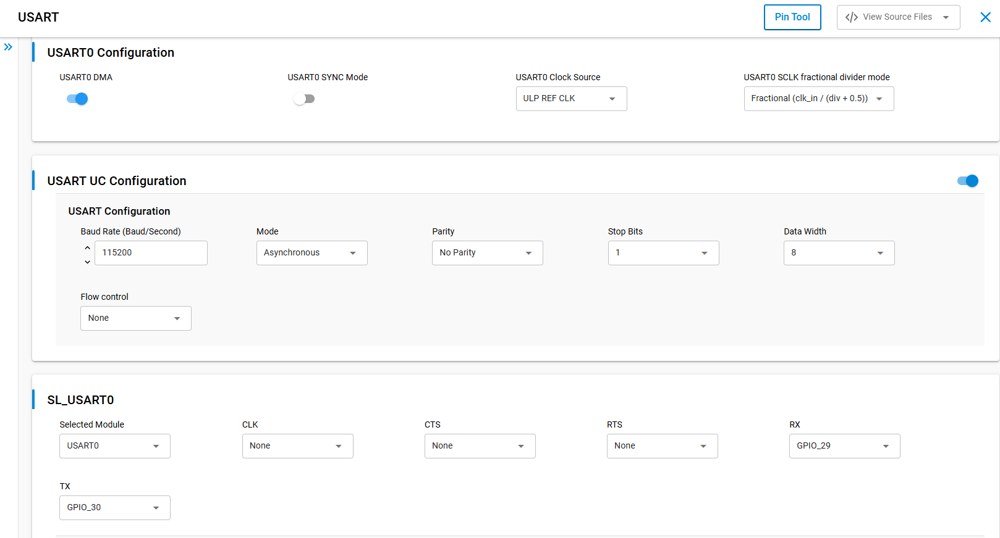

# SL USART ASYNCHRONOUS

## Table of Contents

- [SL USART ASYNCHRONOUS](#sl-usart-asynchronous)
  - [Table of Contents](#table-of-contents)
  - [Purpose/Scope](#purposescope)
  - [Overview](#overview)
  - [About Example Code](#about-example-code)
  - [Prerequisites/Setup Requirements](#prerequisitessetup-requirements)
    - [Hardware Requirements](#hardware-requirements)
    - [Software Requirements](#software-requirements)
    - [Setup Diagram](#setup-diagram)
  - [Getting Started](#getting-started)
  - [Application Build Environment](#application-build-environment)
  - [USART Baud Rate Configuration](#usart-baud-rate-configuration)
  - [Pin Configuration](#pin-configuration)
  - [Flow Control Configuration](#flow-control-configuration)
  - [Test the Application](#test-the-application)
  - [Configuring higher clock](#configuring-higher-clock)
  - [Resources](#resources)

## Purpose/Scope

This application demonstrates how to configure Universal Synchronous Asynchronous Receiver-Transmitter (USART) In Asynchronous mode. It will send and receive data from serial console.

## Overview

- USART is used in communication through wired medium in both Synchronous and Asynchronous fashion. It enables the device to communicate using serial protocols.
- This application is configured with following configurations:
  - Tx and Rx enabled
  - Asynchronous mode
  - 8 Bit data transfer
  - Stop bits 1
  - No Parity
  - No Auto Flow control
  - Baud Rates - 115200

## About Example Code

- [`usart_async_example.c`](https://github.com/SiliconLabs/wiseconnect/blob/v4.0.2-content-for-docs/examples/si91x_soc/peripheral/sl_si91x_usart_async/usart_async_example.c) - This example code demonstrates how to configure the USART to send and receive data.
- In this example, first USART gets initialized (if not already) with clock and DMA configurations if DMA is enabled using [`sl_si91x_usart_init`](https://docs.silabs.com/wiseconnect/latest/wiseconnect-api-reference-guide-si91x-peripherals/usart#sl-si91x-usart-init).  
**Note:** If the UART/USART instance is already selected for debug output logs, initialization will return `SL_STATUS_NOT_AVAILABLE`.
- After USART initialization, USART is configured with the default configurations from UC along with the USART transmit and receive lines using [`sl_si91x_usart_set_configuration`](https://docs.silabs.com/wiseconnect/latest/wiseconnect-api-reference-guide-si91x-peripherals/usart#sl-si91x-usart-set-configuration).
- Then the register user event callback for send and receive complete notification is set using [`sl_si91x_usart_multiple_instance_register_event_callback`](https://docs.silabs.com/wiseconnect/latest/wiseconnect-api-reference-guide-si91x-peripherals/usart#sl-si91x-usart-multiple-instance-register-event-callback).
- After setting the user event callback, the data send and receive can happen through [`sl_si91x_usart_async_send_data`](https://docs.silabs.com/wiseconnect/latest/wiseconnect-api-reference-guide-si91x-peripherals/usart#sl_si91x_usart_async_send_data) and [`sl_si91x_usart_async_receive_data`](https://docs.silabs.com/wiseconnect/latest/wiseconnect-api-reference-guide-si91x-peripherals/usart#sl_si91x_usart_async_receive_data) respectively.
- Once the receive data event is triggered, both transmit and receive buffer data is compared to confirm if the received data is the same.

## Prerequisites/Setup Requirements

### Hardware Requirements

- Windows PC
- Silicon Labs Si917 Evaluation Kit [[BRD4002](https://www.silabs.com/development-tools/wireless/wireless-pro-kit-mainboard?tab=overview) + [BRD4338A](https://www.silabs.com/development-tools/wireless/wi-fi/siwx917-rb4338a-wifi-6-bluetooth-le-soc-radio-board?tab=overview) / [BRD4342A](https://www.silabs.com/development-tools/wireless/wi-fi/siwx91x-rb4342a-wifi-6-bluetooth-le-soc-radio-board?tab=overview) / [BRD4343A](https://www.silabs.com/development-tools/wireless/wi-fi/siw917y-rb4343a-wi-fi-6-bluetooth-le-8mb-flash-radio-board-for-module?tab=overview)]
- SiWx917 AC1 Module Explorer Kit [BRD2708A](https://www.silabs.com/development-tools/wireless/wi-fi/siw917y-ek2708a-explorer-kit)

### Software Requirements

- Simplicity Studio
- Serial console setup
  - For Serial Console setup instructions, refer to [link name](https://docs.silabs.com/wiseconnect/latest/wiseconnect-developers-guide-developing-for-silabs-hosts/using-the-simplicity-studio-ide#console-input-and-output).

### Setup Diagram

> 

## Getting Started

Refer to the instructions [here](https://docs.silabs.com/wiseconnect/latest/wiseconnect-getting-started/) to:

- [Install Simplicity Studio](https://docs.silabs.com/wiseconnect/latest/wiseconnect-developers-guide-developing-for-silabs-hosts/using-the-simplicity-studio-ide#install-simplicity-studio)
- [Install WiSeConnect extension](https://docs.silabs.com/wiseconnect/latest/wiseconnect-developers-guide-developing-for-silabs-hosts/using-the-simplicity-studio-ide#install-the-wiseconnect-3-extension)
- [Connect your device to the computer](https://docs.silabs.com/wiseconnect/latest/wiseconnect-developers-guide-developing-for-silabs-hosts/using-the-simplicity-studio-ide#connect-siwx91x-to-computer)
- [Upgrade your connectivity firmware](https://docs.silabs.com/wiseconnect/latest/wiseconnect-developers-guide-developing-for-silabs-hosts/using-the-simplicity-studio-ide#update-siwx91x-connectivity-firmware)
- [Create a Studio project](https://docs.silabs.com/wiseconnect/latest/wiseconnect-developers-guide-developing-for-silabs-hosts/using-the-simplicity-studio-ide#create-a-project)

For details on the project folder structure, see the [WiSeConnect Examples](https://docs.silabs.com/wiseconnect/latest/wiseconnect-examples/#example-folder-structure) page.

## Application Build Environment

**Configuration of USART at UC (Universal Configuration)**

- Configure UC from the slcp component.
- Open the **sl_si91x_usart_async.slcp** project file, select the **Software Component** tab, and search for **USART** in the search bar.
- You can use the configuration wizard to configure different parameters. The following configuration screen illustrates where the user can select as per their requirements.

  > 

- For higher baud rates, the USART needs a sufficiently high input clock ($F_{in}$) from the clock source you select in UC. Common upgrades from a slow reference such as **`ULP REF CLK`** include **`SOC PLL CLK`** or **`INTF PLL CLK`**, depending on how the rest of your project configures the SoC and interface PLLs. The best choice is **not fixed in this readme**: it depends on target baud, divider/fractional mode, and what your **specific part and board** allow. Always confirm available frequencies and supported clock paths in the **datasheet for your target SiWx91x device** (clocking and USART / timing specifications).
- **Note:** In the USART Universal Configurator, set **USART0 SCLK fractional divider mode** (Fractional vs Clock swallow) to match the baud-clock math you need. Choose it using the formulas and clock-swallow vs fractional rules in [USART Baud Rate Configuration](#usart-baud-rate-configuration) below—especially how **N** (`RTE_USART0_CLK_DIV_FACT`) combines with each mode—so the UC selection stays consistent with your target baud and $F_{in}$.

## USART Baud Rate Configuration

The USART baud rate is derived from the peripheral clock $f_{UART}$, which depends on the USART clock configuration in the board/device RTE (for example `RTE_Device_917.h`).

### Baud rate formula

$$
\text{Baud} = \frac{f_{UART}}{16 \times \text{Divisor}}
$$

Equivalently:

$$
\text{Divisor} = \frac{f_{UART}}{16 \times \text{Baud}}
$$

$$
\text{Divisor} \geq 1
$$

The last line is a hardware constraint: the USART divisor must be at least 1.

### USART clock ($f_{UART}$) from the input clock ($F_{in}$)

The baud engine clock $f_{UART}$ is the USART SCLK **after** the SCLK divide stage. In the [*SiWx917 Family Reference Manual*](https://www.silabs.com/documents/public/reference-manuals/siw917x-family-rm.pdf) (Clock Architecture), the SCLK divide field (register **USARTx_SCLK_DIV_FAC**; in RTE this is **`RTE_USART0_CLK_DIV_FACT`**, call it **N**) is interpreted together with **USARTx_SCLK_FRAC_SEL** (RTE: **`RTE_USART0_FRAC_DIV_SEL`** / `USART_CLOCK_SWALLOW` vs `USART_FRACTIONAL_DIVIDER`). The family reference manual text (e.g. for UART1 USART SCLK; USART0 is analogous) states:

**Clock swallow — `USARTx_SCLK_FRAC_SEL` = 0** (`USART_CLOCK_SWALLOW`):

- **N = 0 or N = 1:** divider is **bypassed** → $f_{UART} \approx F_{in}$
- **N > 1:** $\displaystyle f_{UART} = \frac{F_{in}}{N}$

**Fractional — `USARTx_SCLK_FRAC_SEL` = 1** (`USART_FRACTIONAL_DIVIDER`):

- **N = 0:** clock **gated** (not a usable run clock in normal UART use)
- **N = 1 … 7** (only the low bits are valid in this mode per the family reference manual): $\displaystyle f_{UART} = \frac{F_{in}}{N + 0.5}$

So in **fractional** mode, **N = 1** gives $f_{UART} = F_{in} / 1.5$, not a bypass. In **clock-swallow** mode, **N = 1** is a bypass (same as **N = 0**), which matches the common RTE default **N = 1**.

Firmware uses the same rules in **`RSI_CLK_GetUsart0Clock`** (`clock_update.c`): integer path divides only when $N \neq 0$ (so **N = 1** yields $F_{in}/1$); fractional path uses $F_{in}/(N+0.5)$ when $N \neq 0$.

### Important notes

1. The baud rate depends on $f_{UART}$, which is controlled by the SCLK divider and **FRAC_SEL** mode per the family reference manual table above.
2. An incorrect divider or mode can produce an unexpected on-wire baud rate.
3. Do not mix up **clock-swallow** vs **fractional** behavior for small **N**: **N = 1** is **bypass** only when **FRAC_SEL** selects clock swallow; with **fractional** selected, **N = 1** is **$F_{in}/1.5$**.

### Configuration steps

1. Compute the target UART clock:

$$
f_{UART,\text{ ideal}} = 16 \times \text{Baud}
$$

2. For a given $F_{in}$, compute $f_{UART}$ using the **clock-swallow** vs **fractional** rules in the previous section (including **N = 0** or **1** bypass in clock-swallow mode, and **N = 1 → $F_{in}/1.5$** in fractional mode).

3. Pick **N** and **FRAC_SEL** so that:

$$
f_{UART} \approx f_{UART,\text{ ideal}}
$$

4. Compute the USART divisor:

$$
\text{Divisor} = \frac{f_{UART}}{16 \times \text{Baud}}
$$

5. Enforce the constraint below and prefer a configuration that yields an **integer** $\text{Divisor}$ when possible:

$$
\text{Divisor} \geq 1
$$

### Mode selection guidelines

- Prefer **integer mode** (`USART_CLOCK_SWALLOW`) when it can match the required baud rate accurately enough.
- Use **fractional mode** (`USART_FRACTIONAL_DIVIDER`) when integer mode cannot get close enough to the target baud rate.
- Apply the same choice in **UC** under **USART0 SCLK fractional divider mode** so it matches the mode you derived from the formulas above.

For very high baud rates (for example above ~2 Mbps), you typically need a higher $F_{in}$ from the USART clock source in UC (often **`SOC PLL CLK`** or **`INTF PLL CLK`** rather than a low-speed reference); see [Configuring higher clock](#configuring-higher-clock) and your **device datasheet** to validate the clock source and frequency for your use case.

## Pin Configuration

  | USART PINS     | GPIO    | Breakout pin  | Explorer kit Breakout pin | UART-TTL cable |
  | -------------- | ------- | ------------- | -------------- | ------------- |
  | USART0_TX_PIN  | GPIO_30 |     P35       |      [RST]     | RX pin         |
  | USART0_RX_PIN  | GPIO_29 |     P33       |      [AN]      | TX Pin         |

 

## Flow Control Configuration

- Set the SL_USART_FLOW_CONTROL_TYPE parameter to SL_USART_FLOW_CONTROL_RTS_CTS to enable USART flow control.
- Make the following two macros in `RTE_Device_917.h`  to '1' to map RTS and CTS pins to WSTK/WPK Main Board EXP header or breakout pins.

  ```C
  #define RTE_USART0_CTS_PORT_ID    1
  #define RTE_USART0_RTS_PORT_ID    1
  ```

  | USART PINS     | GPIO    | Breakout pin  | Explorer kit Breakout pin|
  | -------------- | ------- | ------------- | ------------------------ |
  | USART0_CTS_PIN | GPIO_26 |     P27       |           [MISO]         |
  | USART0_RTS_PIN | GPIO_28 |     P31       |           [CS]           |

## Test the Application

1. Connect TX pin (GPIO_30) to RX pin of UART to TTL cable and RX pin (GPIO_29) to TX pin of UART-TTL cable and open UART-TTL's serial console.
2. When the application runs, USART sends and receives data in full-duplex mode.
3. Observe the USART transmission status upon data transmission from USART master to slave and vice-versa on USART pins i.e UART-TTL's serial console .
4. Send back the data received on UART-TTL's serial console to complete loopback operation.
5. After running this application, the following console output can be observed in the vcom's serial console.

    > 
>
> **Note**:
>
>- Add usart_data_in buffer to watch window for checking receive data.

## Configuring higher clock

- For baud rates well above ~2 Mbps (or whenever the baud math in [USART Baud Rate Configuration](#usart-baud-rate-configuration) requires a faster USART input), set **USART0 Clock Source** in UC to a **higher-frequency path** your project supports—commonly **`SOC PLL CLK`** or **`INTF PLL CLK`** instead of **`ULP REF CLK`**. Both can support high baud rates **when** the resulting $F_{in}$, SCLK divider, and fractional mode meet the formulas and $\text{Divisor} \geq 1$. This matches the **Application Build Environment** guidance: choose **`SOC PLL CLK`** or **`INTF PLL CLK`** according to your project’s PLL setup, not a single fixed rule. **Use the datasheet for your exact SiWx91x target** to confirm maximum USART-related clock frequencies and which PLL outputs are valid for your silicon and radio board or module.

> **Note:**
>
> Interrupt handlers are implemented in the driver layer, and user callbacks are provided for custom code. If you want to write your own interrupt handler instead of using the default one, make the driver interrupt handler a weak handler. Then, copy the necessary code from the driver handler to your custom interrupt handler.
> By default, Request to Send (RTS) and Clear to Send (CTS) flow control signals are disabled in the UART driver UC, and their corresponding GPIO pins are not assigned in the Pintool. If you enable RTS/CTS in the Driver UC, you must manually configure and assign the appropriate GPIO pins in the Pintool to ensure proper hardware flow control functionality.

## Resources

- [SiWx917 Family Reference Manual](https://www.silabs.com/documents/public/reference-manuals/siw917x-family-rm.pdf) (PDF)
- **Device datasheet** for your exact SiWx91x part (clock frequencies, PLLs, and peripheral timing)—use the documentation tab on that part’s page at [silabs.com](https://www.silabs.com/) when choosing USART clock sources for a target baud.
