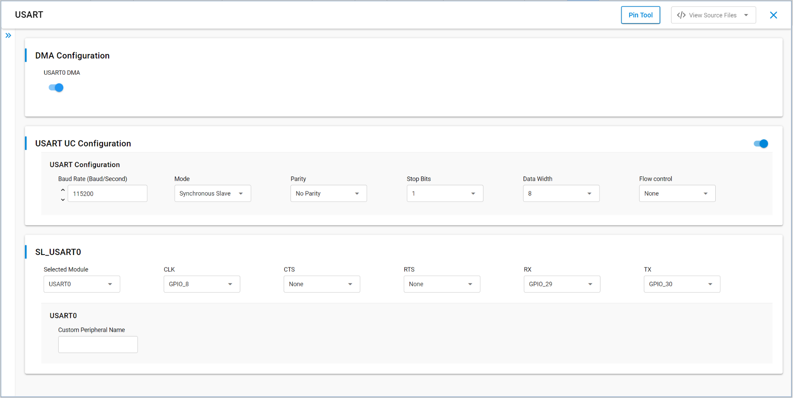

# SL USART SLAVE

## Table of Contents

- [SL USART SLAVE](#sl-usart-slave)
  - [Table of Contents](#table-of-contents)
  - [Purpose/Scope](#purposescope)
  - [Overview](#overview)
  - [About Example Code](#about-example-code)
  - [Prerequisites/Setup Requirements](#prerequisitessetup-requirements)
    - [Hardware Requirements](#hardware-requirements)
    - [Software Requirements](#software-requirements)
    - [Setup Diagram](#setup-diagram)
  - [Getting Started](#getting-started)
  - [Application Build Environment](#application-build-environment)
    - [Configuration of USART at UC (Universal Configuration)](#configuration-of-usart-at-uc-universal-configuration)
    - [Pin Configuration of the WPK\[BRD4002A\] Base Board, and with BRD4338A radio board](#pin-configuration-of-the-wpkbrd4002a-base-board-and-with-brd4338a-radio-board)
    - [Pin Configuration of the WPK\[BRD4002A\] Base Board, and with BRD4343A radio board](#pin-configuration-of-the-wpkbrd4002a-base-board-and-with-brd4343a-radio-board)
    - [Pin Configuration of the AC1 Module Explorer Kit](#pin-configuration-of-the-ac1-module-explorer-kit)
  - [Flow Control Configuration](#flow-control-configuration)
  - [Test the Application](#test-the-application)
  - [Configuring higher clock](#configuring-higher-clock)

## Purpose/Scope

This application demonstrates how to configure the Universal Synchronous/Asynchronous Receiver-Transmitter (USART) in synchronous mode as a slave. It receives a block of data from a synchronous master while simultaneously transmitting a response for loopback verification.

## Overview

- USART is used in communication through wired medium in a Synchronous fashion. It enables the device to communicate using serial protocols.
- This application is configured with following configurations:
  - Tx and Rx enabled
  - 8 Bit data transfer
  - Synchronous slave
  - Stop bits 1
  - No Parity
  - No Auto Flow control
  - Baud Rates - 115200

## About Example Code

- [`usart_sync_example.c`](https://github.com/SiliconLabs/wiseconnect/blob/v4.0.0-content-for-docs/examples/si91x_soc/peripheral/sl_si91x_usart_sync_slave/usart_sync_example.c) – Demonstrates configuring the USART to send and receive data in synchronous slave mode.
- In this example, first USART gets initialized if not already initialized with clock and DMA configurations using [`sl_si91x_usart_init`](https://docs.silabs.com/wiseconnect/latest/wiseconnect-api-reference-guide-si91x-peripherals/usart#sl-si91x-usart-init).  
**Note:** If the UART/USART instance is already selected for debug output logs, initialization returns `SL_STATUS_NOT_AVAILABLE` (informational; the example continues using the existing instance).
- After initialization, USART configured (clock, pins, synchronous mode, etc.) using [`sl_si91x_usart_set_configuration()`](https://docs.silabs.com/wiseconnect/latest/wiseconnect-api-reference-guide-si91x-peripherals/usart#sl-si91x-usart-set-configuration) either from UC parameters or from user-defined macros.
- Then the register user event callback for send and receive complete notification is set using [`sl_si91x_usart_multiple_instance_register_event_callback()`](https://docs.silabs.com/wiseconnect/latest/wiseconnect-api-reference-guide-si91x-peripherals/usart#sl-si91x-usart-multiple-instance-register-event-callback).
- After setting the user event callback, the data send and receive can happen through [`sl_si91x_usart_transfer_data()`](https://docs.silabs.com/wiseconnect/latest/wiseconnect-api-reference-guide-si91x-peripherals/usart#sl-si91x-usart-transfer-data).
- When the transfer completes, the transmit and receive buffers are compared to confirm loopback success.

### Configuration Macros

The header file [`usart_sync_example.h`](https://github.com/SiliconLabs/wiseconnect/blob/v4.0.0-content-for-docs/examples/si91x_soc/peripheral/sl_si91x_usart_sync_slave/usart_sync_example.h) exposes build-time macros:

| Macro | Purpose | Effect if Disabled | Error Returned? |
|-------|---------|--------------------|-----------------|
| `SL_USART_SYNCH_MODE` | Ensures the example validates synchronous mode operation. | Example runs but will not explicitly assert synchronous usage; configuration may fall back to UC settings. | No. |
| `USE_SEND` | (Reserved for continuous send sequencing) Intended to enable repeated transmit cycles. | Currently unused; disabling has no effect. | No. |
| `USE_RECEIVE` | (Reserved for continuous receive sequencing) Intended to enable repeated capture cycles. | Currently unused; disabling has no effect. | No. |
| `NON_UC_DEFAULT_CONFIG` (in `usart_sync_example.c`) | Use hard-coded default configuration instead of UC component settings. | UC (Universal Configuration) values are used. | No. |

These macros gate optional or illustrative behavior and do not cause failures when disabled. To customize settings without UC, enable `NON_UC_DEFAULT_CONFIG` and adjust the structure values in `usart_sync_example.c`.

Advanced users may edit the device configuration header `RTE_Device_917.h` directly for pin/peripheral routing; normally UC handles this automatically.

## Prerequisites/Setup Requirements

### Hardware Requirements

- Windows PC
- Silicon Labs Si917 Evaluation Kit [[BRD4002](https://www.silabs.com/development-tools/wireless/wireless-pro-kit-mainboard?tab=overview) + [BRD4338A](https://www.silabs.com/development-tools/wireless/wi-fi/siwx917-rb4338a-wifi-6-bluetooth-le-soc-radio-board?tab=overview) / [BRD4342A](https://www.silabs.com/development-tools/wireless/wi-fi/siwx91x-rb4342a-wifi-6-bluetooth-le-soc-radio-board?tab=overview) / [BRD4343A](https://www.silabs.com/development-tools/wireless/wi-fi/siw917y-rb4343a-wi-fi-6-bluetooth-le-8mb-flash-radio-board-for-module?tab=overview)]- Master and Slave
- SiWx917 AC1 Module Explorer Kit [BRD2708A](https://www.silabs.com/development-tools/wireless/wi-fi/siw917y-ek2708a-explorer-kit) - Master and Slave

### Software Requirements

- Simplicity Studio
- Serial console Setup
  - For Serial Console setup instructions, refer [Console Inpput and Output](https://docs.silabs.com/wiseconnect/latest/wiseconnect-developers-guide-developing-for-silabs-hosts/using-the-simplicity-studio-ide#console-input-and-output) section of the *WiSeConnect Developer's Guide*.

### Setup Diagram

> 

## Getting Started

Refer to the instructions [here](https://docs.silabs.com/wiseconnect/latest/wiseconnect-getting-started/) to:

- [Install Simplicity Studio](https://docs.silabs.com/wiseconnect/latest/wiseconnect-developers-guide-developing-for-silabs-hosts/using-the-simplicity-studio-ide#install-simplicity-studio)
- [Install WiSeConnect extension](https://docs.silabs.com/wiseconnect/latest/wiseconnect-developers-guide-developing-for-silabs-hosts/using-the-simplicity-studio-ide#install-the-wiseconnect-3-extension)
- [Connect your device to the computer](https://docs.silabs.com/wiseconnect/latest/wiseconnect-developers-guide-developing-for-silabs-hosts/using-the-simplicity-studio-ide#connect-siwx91x-to-computer)
- [Upgrade your connectivity firmware](https://docs.silabs.com/wiseconnect/latest/wiseconnect-developers-guide-developing-for-silabs-hosts/using-the-simplicity-studio-ide#update-siwx91x-connectivity-firmware)
- [Create a Studio project](https://docs.silabs.com/wiseconnect/latest/wiseconnect-developers-guide-developing-for-silabs-hosts/using-the-simplicity-studio-ide#create-a-project)

For details on the project folder structure, see the [WiSeConnect Examples](https://docs.silabs.com/wiseconnect/latest/wiseconnect-examples/#example-folder-structure) page.

## Application Build Environment

### Configuration of USART at UC (Universal Configuration)

- Configure UC from the slcp component.
- Open **sl_si91x_usart_sync_slave.slcp** project file, select the **Software Component** tab, and search for **USART** in the search bar.
- You can use the configuration wizard to configure different parameters. The following configuration screens illustrates where the user can select as per their requirements.

  

- Connect the boards: master clock (GPIO_8 or GPIO_25) ↔ slave clock, master TX (GPIO_30) → slave RX (GPIO_29), slave TX (GPIO_30) → master RX (GPIO_29). (Clock direction is from master to slave.)

### Pin Configuration of the WPK[BRD4002A] Base Board, and with BRD4338A radio board

  | USART PINS              | GPIO    | Breakout pin  |
  | ----------------------- | ------- | ------------- |
  | USART_SLAVE_CLOCK_PIN  | GPIO_8  |     F8        |
  | USART_SLAVE_TX_PIN     | GPIO_30 |     P35       |
  | USART_SLAVE_RX_PIN     | GPIO_29 |     P33       |

### Pin Configuration of the WPK[BRD4002A] Base Board, and with BRD4343A radio board

  | USART PINS              | GPIO    | Breakout pin  |
  | ----------------------- | ------- | ------------- |
  | USART_SLAVE_CLOCK_PIN  | GPIO_8  |      F8       |
  | USART_SLAVE_TX_PIN     | GPIO_30 |     P35       |
  | USART_SLAVE_RX_PIN     | GPIO_29 |     P33       |  
  
### Pin Configuration of the WPK[BRD4002A] Base Board, and with BRD4342A radio board

  | USART PINS              | GPIO    | Breakout pin  |
  | ----------------------- | ------- | ------------- |
  | USART_SLAVE_CLOCK_PIN  | GPIO_25 |     P25       |
  | USART_SLAVE_TX_PIN     | GPIO_30 |     P35       |
  | USART_SLAVE_RX_PIN     | GPIO_29 |     P33       |  

  

### Pin Configuration of the AC1 Module Explorer Kit

  | USART PINS              | GPIO    | Explorer kit Breakout pin  |
  | ----------------------- | ------- | ------------- |
  | USART_SLAVE_CLOCK_PIN   | GPIO_25 |     [SCK]     |
  | USART_SLAVE_TX_PIN      | GPIO_30 |     [RST]     |
  | USART_SLAVE_RX_PIN      | GPIO_29 |     [AN]      |

## Flow Control Configuration

To enable hardware flow control (RTS/CTS):

1. Open `sl_si91x_usart_sync_slave.slcp` → Software Components → USART.
2. Set **Flow control** to **RTS/CTS**.
3. Assign RTS and CTS pins either:

- Through the UC pin assignment widget (preferred), OR
- Manually by editing `RTE_Device_917.h` in the USART0 section.

4. Use the following default mapping if the Pin Tool is unavailable:

  | Signal | GPIO  | WPK Breakout | AC1 Explorer |
  |--------|-------|--------------|--------------|
  | CTS    | GPIO_26 | P27 | [MISO] |
  | RTS    | GPIO_28 | P31 | [CS]   |

If the Pin Tool is not working, UC changes plus manual verification in `RTE_Device_917.h` ensure proper hardware flow control routing.

## Test the Application

1. Flash `sl_si91x_usart_sync_master` on one board and `sl_si91x_usart_sync_slave` (this project) on a second board.
2. Wire clock, TX, and RX between the two boards as listed in the pin tables.
3. Open a serial console for each board.
4. Reset both boards; the master initiates a 1024‑byte full‑duplex transfer.
5. After transfer completion the slave compares `usart_data_out` and `usart_data_in` and prints the loopback result.
6. Expected console output (slave):

  

>
> **Note**:
>
>- To monitor incoming data during debugging sessions, add the `usart_data_in` buffer to your watch window. This allows you to inspect received data in real time while stepping through the code.

## Configuring higher clock

- To achieve baud rates exceeding 2 million bps, need to modify the clock source to INTF PLL CLK or SoC PLL CLK in the UC. 

> **Note:**
>
> - Interrupt handlers are implemented in the driver layer, and user callbacks are provided for custom code. If you want to write your own interrupt handler instead of using the default one, make the driver interrupt handler a weak handler. Then, copy the necessary code from the driver handler to your custom interrupt handler.
> - By default, RTS/CTS flow control signals are disabled in the UART driver UC and pins are unassigned. After enabling RTS/CTS, assign the GPIOs via UC or edit `RTE_Device_917.h` if the Pin Tool is unavailable.
