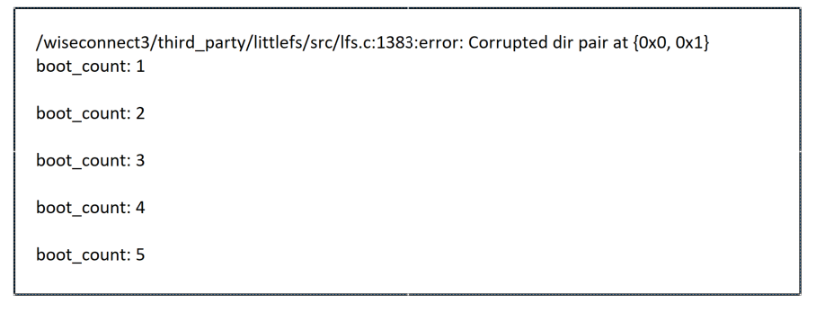

# SL LITTLEFS BASED COMMON FLASH FILE SYSTEM

## Table of Contents

- [SL FILE SYSTEM FOR COMMON FLASH](#sl-file-system-for-common-flash)
  - [Table of Contents](#table-of-contents)
  - [Purpose/Scope](#purposescope)
  - [Overview](#overview)
  - [About Example Code](#about-example-code)
  - [Prerequisites/Setup Requirements](#prerequisitessetup-requirements)
    - [Hardware Requirements](#hardware-requirements)
    - [Software Requirements](#software-requirements)
    - [Setup Diagram](#setup-diagram)
  - [Getting Started](#getting-started)
  - [Application Build Environment](#application-build-environment)
  - [Test the Application](#test-the-application)

## Purpose/Scope

This example demonstrates a simple persistent **file system** on **Si91x common flash** using **LittleFS**.  
On each boot, the application mounts LittleFS, reads a stored counter from the file `boot_count`, increments it, writes it back, and prints the value to the console.

**Key Features:**
- File system operations using LittleFS on common flash
- Persistent data storage that survives power cycles
- Automatic file system formatting on first run
- Boot count tracking to demonstrate read/write operations

**boot_count File:** This file stores the boot count value in flash memory and persists across device resets.

## Overview

- This example interfaces with flash through QSPI interface using littlefs.
- The program can be interrupted at any time without losing track of how many times it has been booted and without corrupting the filesystem.

## About Example Code

- The example code in **app.c** shows how to set up QSPI to access flash memory for a file system using the LittleFS library.
- Initialize the NWP for LittleFS using `sl_net_init()`, as flash read/write operations require communication between the NWP and M4.
- To use the file system, call `lfs_mount()`.
- Open a file and read the current boot count  `lfs_file_read()`.
- Update the boot count `lfs_file_write()`.
- Close the file using `lfs_file_close()` and unmount the file system using `lfs_unmount()`.

## Prerequisites/Setup Requirements

### Hardware Requirements

- Windows PC
- Silicon Labs Si917 Evaluation Kit 

**Note:**
>- For detailed information about pinset configurations, refer to the Flash and PSRAM Combinations section in the [Software Reference Manual](https://github.com/SiliconLabs/wiseconnect/blob/release/v3.5.2/docs/software-reference/manuals/siwx91x-software-reference-manual.md).

### Software Requirements

- Simplicity Studio
- Serial console Setup
  - For Serial Console setup instructions, refer to [here](https://docs.silabs.com/wiseconnect/latest/wiseconnect-developers-guide-developing-for-silabs-hosts/using-the-simplicity-studio-ide#console-input-and-output).

### Setup Diagram

> 

## Getting Started

Refer to the instructions [here](https://docs.silabs.com/wiseconnect/latest/wiseconnect-getting-started/) to:

- [Install Simplicity Studio](https://docs.silabs.com/wiseconnect/latest/wiseconnect-developers-guide-developing-for-silabs-hosts/using-the-simplicity-studio-ide#install-simplicity-studio)
- [Install WiSeConnect extension](https://docs.silabs.com/wiseconnect/latest/wiseconnect-developers-guide-developing-for-silabs-hosts/using-the-simplicity-studio-ide#install-the-wiseconnect-3-extension)
- [Connect your device to the computer](https://docs.silabs.com/wiseconnect/latest/wiseconnect-developers-guide-developing-for-silabs-hosts/using-the-simplicity-studio-ide#connect-siwx91x-to-computer)
- [Upgrade your connectivity firmware](https://docs.silabs.com/wiseconnect/latest/wiseconnect-developers-guide-developing-for-silabs-hosts/using-the-simplicity-studio-ide#update-siwx91x-connectivity-firmware)
- [Create a Studio project](https://docs.silabs.com/wiseconnect/latest/wiseconnect-developers-guide-developing-for-silabs-hosts/using-the-simplicity-studio-ide#create-a-project)


## Test the Application

1. Run the application
2. Observe boot_count on console output
 > 
3. Reset the MCU, every reset will increase the boot count.
> **Note**:
>
>- When we run the littlefs example first time, after flash erase we see the errors **(error: Corrupted dir pair at {0x0, 0x1})** because flash is not yet formatted for littlefs. So ignore the error when its run first time.

> - **Resetting `boot_count`**
>   - *Using LittleFS APIs:*  
>     Call the LittleFS API to re-format the filesystem region:
>     ```c
>     lfs_unmount(&lfs);
>     lfs_format(&lfs, &cfg);
>     lfs_mount(&lfs, &cfg);
>     ```
>     This clears all files and re-initializes the LittleFS volume without erasing the entire chip.
>
>   - *Alternative (Using Studio tools/Simplicity Commander):*  
>     Perform a chip or flash-region erase, then re-program the image.
>     - **Simplicity Studio:**  
>       From Tools, Open **Flash Programmer → Erase Chip**, then **Program** and **Run** the application again.  
>     - **Simplicity Commander CLI:**  
>       ```bash
>       commander device masserase
>       ```
>
> - **Reminder:** A mass erase removes the application too. Re-flash the binary after erasing.
