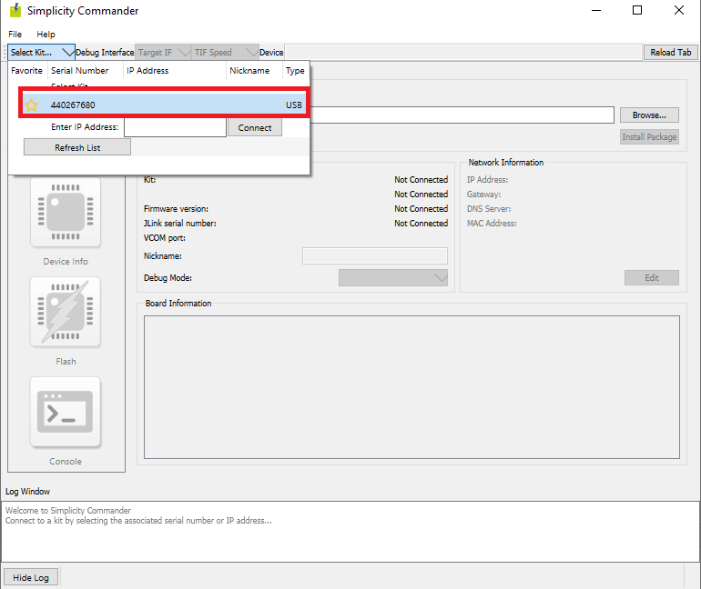

# Wi-Fi - Firmware Flashing from Host UART

## Table of Contents

- [Purpose/Scope](#purposescope)
- [Prerequisites/Setup Requirements](#prerequisitessetup-requirements)
  - [Hardware Requirements](#hardware-requirements)
    - [Standalone](#standalone)
    - [Kits](#kits)
    - [Interface and Host MCU Supported](#interface-and-host-mcu-supported)
  - [Software Requirements](#software-requirements)
  - [Setup Diagram](#setup-diagram)
- [Getting Started](#getting-started)
- [Application Build Environment](#application-build-environment)
  - [App Configuration](#app-configuration)
- [Test the Application](#test-the-application)
- [Application Output Logs](#application-output-logs)
- [Console Prints](#console-prints)
- [Timings Observed](#timings-observed)
- [Appendix](#appendix)

## Purpose/Scope

This application demonstrates how to flash the firmware on the Si91x device from the Host MCU using XMODEM protocol. The system consists of three main components:

  - Host PC: Contains the firmware file and the Tera Term (Xmodem protcol) for updating firmware
  - Host MCU: Acts as an intermediary between the PC and the Si91x device. It receives firmware data from the PC over UART and transfers it to the Si91x device via SPI.
  - Si91x Device: The target embedded system that needs a firmware update. It receives firmware data from the Host MCU and updates its firmware.
  
## Prerequisites/Setup Requirements

### Hardware Requirements  
  - Windows PC or Mac
  - Standalone
    - BRD4002A Wireless Pro Kit Mainboard [SI-MB4002A]
    - EFR32xG24 Wireless 2.4 GHz +10 dBm Radio Board [xG24-RB4186C](https://www.silabs.com/development-tools/wireless/xg24-rb4186c-efr32xg24-wireless-gecko-radio-board?tab=overview)
    - NCP Expansion Kit with NCP Radio Boards
      - (BRD4346A + BRD8045A) [SiWx917-EB4346A]
      - (BRD4357A + BRD8045A) [SiWx917-EB4357A]
    - SoC
      - BRD4338A [SiWx917-RB4338A]
      - EFM32/EFR32cGPIO Header board
      > **Note:** Two BRD4002A mainboards are required—one to attach the BRD4338A and another for the EFR32xG24. To connect both BRD4002A boards, an EFM32/EFR32cGPIO Header board is needed.

  - Kits
  	- EFR32xG24 Pro Kit +10 dBm [xG24-PK6009A](https://www.silabs.com/development-tools/wireless/efr32xg24-pro-kit-10-dbm?tab=overview)
  - Interface and Host MCU Supported
    - SPI - EFR32 

### Software Requirements

- Simplicity Studio IDE
- [Teraterm application](https://ttssh2.osdn.jp/index.html.en)

### Setup Diagram


## Getting Started

Refer to the instructions on the [WiSeConnect Getting Started](https://docs.silabs.com/wiseconnect/latest/wiseconnect-getting-started/) page to:

- [Install Simplicity Studio](https://docs.silabs.com/wiseconnect/latest/wiseconnect-developers-guide-developing-for-silabs-hosts/#install-simplicity-studio).
- [Install WiSeConnect extension](https://docs.silabs.com/wiseconnect/latest/wiseconnect-developers-guide-developing-for-silabs-hosts/#install-the-wi-se-connect-extension).
- [Connect your device to the computer](https://docs.silabs.com/wiseconnect/latest/wiseconnect-developers-guide-developing-for-silabs-hosts/#connect-si-wx91x-to-computer).
- [Upgrade your connectivity firmware](https://docs.silabs.com/wiseconnect/latest/wiseconnect-developers-guide-developing-for-silabs-hosts/#update-si-wx91x-connectivity-firmware).
- [Create a Studio project](https://docs.silabs.com/wiseconnect/latest/wiseconnect-developers-guide-developing-for-silabs-hosts/#create-a-project).

For details on the project folder structure, see the [WiSeConnect Examples](https://docs.silabs.com/wiseconnect/latest/wiseconnect-examples/#example-folder-structure) page.

## Application Build Environment

The application can be configured to suit your requirements and development environment.

### App Configuration

- By default, the application does Fast Firmware upgrade.
- For Safe Firmware upgrade, delete this preprocessor macro in preprocessor settings, **SL_SI91X_FAST_FW_UP==1**.
- For secure image, only Safe Firmware upgrade is supported.
- For NCP, only NWP Firmware update is supported.
- For SoC, both NWP and M4 Firmware updates are supported. 
- For SoC, secure image update with secure zone enabled (slave mode), add SLAVE_MODE_TRANSFER in preprocessor settings. Refer to the [Appendix](#appendix) for information on secure zone.
- By default, the application is configured to update the NWP firmware in the **app.c** file: 
    ```c
     #define FW_UPDATE_TYPE NWP_FW_UPDATE
    ```

- For M4 update, make the change as shown below in **app.c** file:
    ```c
     #define FW_UPDATE_TYPE M4_FW_UPDATE
    ```

> **Note**: For recommended settings, please refer the [recommendations guide](https://docs.silabs.com/wiseconnect/latest/wiseconnect-developers-guide-prog-recommended-settings/).

## Test the Application

To test the application, follow these steps:

1. **Build the application** using Simplicity Studio or your preferred build system.
2. **Flash, run, and debug the application** on your target hardware.
3. **Configure the baudrate:**
   - In `app.c`, set the baudrate for firmware flashing:

     ```c
     init.baudrate = 921600;
     ```

   - In Simplicity Studio Launch Console, set the vcom port baudrate:

     ```c
     serial vcom config speed 921600
     ```

   - Setting the vcom port baudrate in Launch Console:
        1. Open Simplicity Studio.
        2. Go to the Launch Console for your connected device.
        3. Enter the above command in the console and press Enter.
        4. Confirm the baudrate is set to **921600** before starting the firmware update.
4. **Open Tera Term and set up the serial connection:**
   - Set the baud rate to **115200** initially via **Setup > Serial port > Speed** and click **New setting**.
     
   - For faster firmware updates, change the baud rate to 921600.
     
5. **Start the firmware flashing process:**
   - After flashing the application, Tera Term should display the character `C` repeatedly, indicating readiness for xmodem transfer. If not, verify connections and baudrate settings.
   - In Tera Term, go to **File > Transfer > XMODEM > Send** and select your firmware file (`.rps`).
   - For SoC boards, press and hold both the Reset and ISP buttons, then release the Reset button first, followed by the ISP button.
   - Begin the xmodem transfer within 90 seconds of seeing the `C` character, or Tera Term will cancel the transfer.
6. **Monitor the update:**
   - The firmware update duration depends on chunk size and baudrate.
   - Application output will be shown in the RTT console in Simplicity Studio. For details, see the [Console Prints](#console-prints) section.

> **Note:** You must start the xmodem transfer within 90 seconds of seeing the `C` character in Tera Term, or the transfer will be cancelled.

### Application Output Logs

#### NCP Output Example

> The output for will appear on the RTT console in Simplicity Studio.

```
DEMO STARTED
fw_upgrade Start
chunk_cnt: 1
chunk_cnt: 2
chunk_cnt: 3
chunk_cnt: 4
chunk_cnt: 5
...
chunk_cnt: 398
chunk_cnt: 399
chunk_cnt: 400
chunk_cnt: 401
chunk_cnt: 402
fw_upgrade Success
fw version after upgrade is:
Firmware version is: 1711.2.14.5.0.0.9
Time taken for firmware flashing:76 secs
DEMO DONE
```

#### SoC Output Example

> The output for will appear on the RTT console in Simplicity Studio.

```
DEMO STARTED
fw_upgrade Start
chunk_cnt: 1
chunk_cnt: 2
chunk_cnt: 3
chunk_cnt: 4
chunk_cnt: 5
chunk_cnt: 6
...
chunk_cnt: 398
chunk_cnt: 399
chunk_cnt: 400
chunk_cnt: 401
chunk_cnt: 402
chunk_cnt: 403
fw_upgrade Success
sl_net_init: 0x4
```

> **Note:** After a successful firmware upgrade, the SI91X_WLAN_FW_UPGRADE_DONE state and steps like network initialization and 'DEMO DONE' are not applicable for SoC. For SoC, you will see `sl_net_init: 0x4` after upgrade, and network initialization steps follow. For NCP, you will see `DEMO DONE` after upgrade.

### Console Prints

- Open Simplicity Studio.
- From the menu, select Tools.
- In the Tools dialog, select Simplicity Commander and click OK.
  


- In the Simplicity Commander window, click Select Kit and choose your radio board.
  


- In the navigation pane, go to the Console section.
- In the Console section, select the RTT tab.
- Enable the check box on Reset target on connect.
- Before you start streaming the logs over RTT, make sure you have flashed the application.

- Click on connect

## Timings Observed

| **XMODEM Bootloader**     | **Using Fast FW Upgrade**| **Using SAFE FW Upgrade** |
|---------------------------|--------------------------|--------------------------|
|**Firmware Upgrade timing**|    3mins 58secs          |     4mins 37secs         |

## Appendix

- [Secure Zone](https://www.silabs.com/documents/public/data-sheets/siwg917-datasheet.pdf)
- [Secure Zone bit](https://www.silabs.com/documents/public/user-guides/ug574-siwx917-soc-manufacturing-utility-user-guide.pdf)
